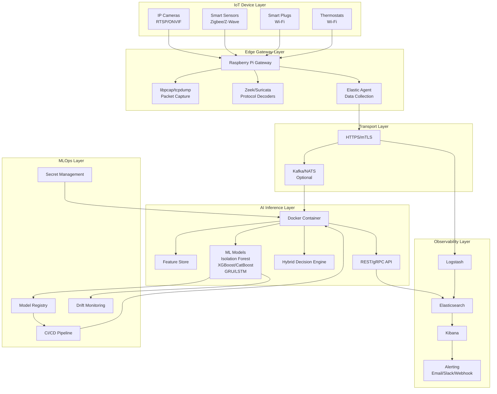

# Design Document: AI-Driven IoT IDS

## Overview

The AI-driven Intrusion Detection System (IDS) is a distributed, multi-layered security architecture designed to protect IoT/ICS networks through hybrid threat detection. The system combines signature-based detection with machine learning-based anomaly detection to identify both known and unknown threats in real-time.

The architecture follows a layered approach:
- **Edge Layer**: Raspberry Pi gateways perform local packet capture and preprocessing
- **Transport Layer**: Secure message buses handle data flow between components  
- **AI Layer**: Containerized inference services provide ML-based threat detection
- **Storage Layer**: Elasticsearch stack manages data persistence and observability
- **Operations Layer**: MLOps pipelines handle model lifecycle management

This design prioritizes security, scalability, and operational efficiency while maintaining low latency for real-time threat detection.

## Architecture

### System Architecture Diagram



### Component Interactions

The system operates through the following interaction patterns:

1. **Data Collection Flow**: IoT devices → Edge Gateway → Transport Layer → AI Inference Service
2. **Detection Flow**: Raw packets → Feature extraction → ML inference → Threat scoring → Alerting
3. **Model Management Flow**: Model Registry → Deployment Pipeline → AI Inference Service → Performance Monitoring
4. **Observability Flow**: All components → Elasticsearch → Kibana → Alerting systems

## Components and Interfaces

### Edge Gateway Component

**Purpose**: Local packet capture, protocol decoding, and feature extraction on Raspberry Pi devices.

**Key Interfaces**:
- `PacketCaptureInterface`: Captures network packets using libpcap/af_packet
- `ProtocolDecoderInterface`: Processes packets through Zeek/Suricata for metadata extraction
- `FeatureExtractorInterface`: Converts raw packet data into ML-ready features
- `SecureForwarderInterface`: Transmits processed data via mTLS to upstream services

**Implementation Details**:
- Uses eBPF/XDP for high-performance packet mirroring
- Implements local buffering with configurable retention policies
- Supports offline operation with local caching capabilities
- ARM-optimized for Raspberry Pi hardware constraints

### AI Inference Service Component

**Purpose**: Containerized ML service providing real-time threat detection and scoring.

**Key Interfaces**:
- `InferenceAPI`: REST/gRPC endpoints for real-time threat scoring
- `FeatureStoreInterface`: Manages tabular and time-series feature data
- `ModelManagerInterface`: Handles model loading, versioning, and hot-swapping
- `DecisionEngineInterface`: Combines signature and ML scores into unified threat assessments

**Model Architecture**:
- **Unsupervised Models**: Isolation Forest and Autoencoder for anomaly detection
- **Supervised Models**: XGBoost/CatBoost for labeled threat classification  
- **Sequence Models**: GRU/LSTM/Transformer for temporal pattern analysis
- **Ensemble Methods**: Weighted voting and stacking for improved accuracy

### Observability Stack Component

**Purpose**: Data persistence, visualization, and alerting using Elasticsearch ecosystem.

**Key Interfaces**:
- `DataIngestionInterface`: Logstash pipelines for data transformation and enrichment
- `StorageInterface`: Elasticsearch indices with ILM policies for lifecycle management
- `VisualizationInterface`: Kibana dashboards for real-time monitoring and investigation
- `AlertingInterface`: Multi-channel notification system (email, Slack, webhooks)

**Data Management**:
- Index templates for consistent data structure across time periods
- ILM policies for automated data lifecycle management (hot/warm/cold/delete)
- Cross-cluster replication for high availability deployments
- Snapshot and restore capabilities for disaster recovery

### MLOps Pipeline Component

**Purpose**: Automated model lifecycle management and deployment orchestration.

**Key Interfaces**:
- `ModelRegistryInterface`: Versioned storage for trained models and metadata
- `DriftMonitorInterface`: Statistical monitoring for model performance degradation
- `DeploymentInterface`: Canary and blue-green deployment strategies
- `RetrainingInterface`: Automated and scheduled model update workflows

**Operational Features**:
- Model versioning with semantic versioning and rollback capabilities
- A/B testing framework for model performance comparison
- Automated hyperparameter tuning using Bayesian optimization
- Integration with CI/CD pipelines for continuous model deployment

## Data Models

### Network Flow Feature Schema

```yaml
NetworkFlow:
  flow_id: string (UUID)
  timestamp: datetime (ISO 8601)
  source_ip: string (IPv4/IPv6)
  destination_ip: string (IPv4/IPv6)
  source_port: integer (0-65535)
  destination_port: integer (0-65535)
  protocol: string (TCP/UDP/ICMP)
  
  # Flow Statistics
  bytes_sent: integer (≥0)
  bytes_received: integer (≥0)
  packets_sent: integer (≥0)
  packets_received: integer (≥0)
  duration_ms: integer (≥0)
  
  # Timing Features
  inter_arrival_mean_ms: float (≥0)
  inter_arrival_std_ms: float (≥0)
  jitter_ms: float (≥0)
  
  # TCP-specific Features
  tcp_flags: array[string] (SYN, ACK, FIN, RST, PSH, URG)
  retransmissions: integer (≥0)
  syn_fin_ratio: float (≥0)
  
  # Connection Patterns
  unique_destinations: integer (≥0)
  fan_out_ratio: float (≥0)
  fan_in_ratio: float (≥0)
  port_distribution_entropy: float (≥0)
```

### Device Profile Schema

```yaml
DeviceProfile:
  device_id: string (MAC address)
  vendor_oui: string (OUI prefix)
  device_type: enum (camera, sensor, plug, thermostat, hub, unknown)
  firmware_version: string (optional)
  
  # Behavioral Baselines
  normal_protocols: array[string]
  allowed_destinations: array[string] (IP ranges/domains)
  typical_bandwidth_bps: integer (≥0)
  activity_schedule: object
    - hour_of_day: array[float] (24 elements, 0-1 activity level)
    - day_of_week: array[float] (7 elements, 0-1 activity level)
  
  # Learning Parameters
  profile_created: datetime
  last_updated: datetime
  confidence_score: float (0-1)
  observation_count: integer (≥0)
```

### Threat Detection Schema

```yaml
ThreatDetection:
  detection_id: string (UUID)
  timestamp: datetime (ISO 8601)
  source_flow_id: string (references NetworkFlow.flow_id)
  device_id: string (references DeviceProfile.device_id)
  
  # Detection Results
  threat_score: float (0-1)
  confidence: float (0-1)
  severity: enum (low, medium, high, critical)
  
  # Detection Methods
  signature_matches: array[object]
    - rule_id: string
    - rule_name: string
    - signature_score: float (0-1)
  
  ml_predictions: array[object]
    - model_name: string
    - model_version: string
    - anomaly_score: float (0-1)
    - feature_importance: object (key-value pairs)
  
  # Context
  attack_category: enum (reconnaissance, lateral_movement, exfiltration, dos, malware)
  mitre_tactics: array[string] (MITRE ATT&CK tactic IDs)
  recommended_actions: array[string]
```

### Configuration Schema

```yaml
SystemConfiguration:
  # Edge Gateway Settings
  edge_gateway:
    packet_capture:
      interface: string
      buffer_size_mb: integer (1-1024)
      capture_filter: string (BPF syntax)
    
    protocol_decoders:
      zeek_enabled: boolean
      suricata_enabled: boolean
      custom_rules_path: string
    
    forwarding:
      upstream_endpoints: array[string] (URLs)
      batch_size: integer (1-10000)
      flush_interval_ms: integer (100-60000)
      retry_attempts: integer (1-10)
  
  # AI Inference Settings  
  ai_inference:
    models:
      isolation_forest:
        enabled: boolean
        contamination: float (0-0.5)
        n_estimators: integer (50-1000)
      
      xgboost:
        enabled: boolean
        max_depth: integer (3-20)
        learning_rate: float (0.01-1.0)
        n_estimators: integer (50-1000)
    
    feature_engineering:
      time_window_minutes: integer (1-60)
      aggregation_functions: array[string] (mean, std, min, max, count)
    
    decision_engine:
      signature_weight: float (0-1)
      ml_weight: float (0-1)
      threshold_low: float (0-1)
      threshold_high: float (0-1)
  
  # Storage Settings
  storage:
    elasticsearch:
      hosts: array[string]
      index_prefix: string
      shard_count: integer (1-10)
      replica_count: integer (0-5)
    
    retention:
      raw_data_days: integer (1-365)
      aggregated_data_days: integer (1-1095)
      alert_data_days: integer (1-2555)
```

## Correctness Properties

*A property is a characteristic or behavior that should hold true across all valid executions of a system—essentially, a formal statement about what the system should do. Properties serve as the bridge between human-readable specifications and machine-verifiable correctness guarantees.*

Based on the prework analysis and property reflection to eliminate redundancy, the following properties ensure system correctness:

### Property 1: Packet Processing Completeness
*For any* valid network packet received by the Edge_Gateway, the system should successfully capture, decode, and extract all required flow-level features including bytes, packets, duration, timing statistics, and protocol-specific metadata without data loss.
**Validates: Requirements 1.1, 1.2, 1.3, 1.4, 1.5, 1.6**

### Property 2: Device Profile Consistency  
*For any* device joining the network, the system should create a complete Device_Profile with correct vendor identification, protocol mapping, behavioral baselines, and role-based allowlists that remain consistent across system restarts.
**Validates: Requirements 2.1, 2.2, 2.3, 2.4, 2.5**

### Property 3: Hybrid Detection Correctness
*For any* network flow processed by the Hybrid_Detection_Engine, the system should apply all configured signature rules and ML models, then produce a unified Threat_Score that accurately reflects the combined assessment from both detection methods.
**Validates: Requirements 3.1, 3.2, 3.3, 3.4, 3.5, 3.6**

### Property 4: AI Service Reliability
*For any* valid feature data submitted to the AI_Inference_Service, the system should preprocess the data correctly, execute inference through available models, and return well-formed JSON responses with threat scores, even when some models are unavailable.
**Validates: Requirements 4.1, 4.2, 4.3, 4.4, 4.5**

### Property 5: Secure Transport Integrity
*For any* data transmission between system components, the system should use mTLS encryption, implement proper retry mechanisms with exponential backoff, and maintain data integrity even under network failures or backpressure conditions.
**Validates: Requirements 5.1, 5.2, 5.3, 5.4, 5.5**

### Property 6: Observability Data Consistency
*For any* security event processed by the Observability_Stack, the system should store it in Elasticsearch with correct index templates, apply Logstash transformations consistently, and trigger appropriate alerts while maintaining data lifecycle policies.
**Validates: Requirements 6.1, 6.2, 6.3, 6.4, 6.5**

### Property 7: MLOps Model Lifecycle Integrity
*For any* model deployment or update in the MLOps_Pipeline, the system should maintain correct versioning in the model registry, detect performance drift accurately, and execute deployment strategies without service interruption.
**Validates: Requirements 7.1, 7.2, 7.3, 7.4, 7.5**

### Property 8: Security Hardening Compliance
*For any* system component deployment, the system should enforce read-only filesystems, non-root execution, proper network segmentation, automatic certificate rotation, and mandatory access controls according to security policies.
**Validates: Requirements 8.1, 8.2, 8.3, 8.4, 8.5**

### Property 9: Performance and Scalability Bounds
*For any* system load condition, the system should maintain bounded memory usage, use high-performance packet processing techniques, scale horizontally under increased load, and implement compression/sampling when bandwidth is constrained.
**Validates: Requirements 9.1, 9.2, 9.3, 9.4, 9.5**

### Property 10: Configuration Round-Trip Consistency
*For any* valid SystemConfiguration object, parsing the configuration from YAML, then serializing it back to YAML, then parsing again should produce an equivalent configuration object with all detection rules and parameters preserved.
**Validates: Requirements 10.1, 10.2, 10.3, 10.4, 10.5**

## Error Handling

### Network and Connectivity Errors

**Packet Capture Failures**:
- When packet capture interfaces become unavailable, the system logs the error and attempts to reconnect with exponential backoff
- If primary capture interface fails, the system falls back to alternative interfaces if configured
- Packet loss is monitored and reported through observability metrics

**Transport Layer Failures**:
- mTLS connection failures trigger certificate validation and renewal processes
- Message bus connectivity issues activate local buffering with configurable retention limits  
- Upstream service unavailability triggers circuit breaker patterns to prevent cascade failures

### AI and ML Model Errors

**Model Loading Failures**:
- When ML models fail to load, the system gracefully degrades to signature-based detection only
- Model corruption or version incompatibility triggers automatic rollback to previous working version
- Missing model dependencies are logged with specific remediation instructions

**Inference Errors**:
- Invalid feature data triggers data validation error responses with detailed field-level feedback
- Model prediction failures are logged and the system continues with available models
- Feature preprocessing errors result in graceful degradation with reduced feature sets

### Data and Storage Errors

**Elasticsearch Connectivity Issues**:
- When Elasticsearch is unavailable, the system activates local buffering with disk-based persistence
- Index creation failures trigger automatic retry with alternative index names
- Storage capacity exhaustion activates emergency data purging based on retention policies

**Configuration Errors**:
- Malformed YAML configuration files generate detailed syntax error messages with line numbers
- Invalid configuration values trigger validation errors with acceptable value ranges
- Configuration hot-reload failures maintain previous working configuration and log specific errors

### Security and Authentication Errors

**Certificate and Authentication Failures**:
- Expired certificates trigger automatic renewal processes before expiration
- Authentication failures are logged with rate limiting to prevent log flooding
- Invalid API keys or tokens result in HTTP 401 responses with renewal instructions

**Access Control Violations**:
- Unauthorized access attempts are logged and blocked with temporary IP-based restrictions
- Privilege escalation attempts trigger security alerts and audit log entries
- Network segmentation violations result in connection termination and policy enforcement

## Testing Strategy

### Dual Testing Approach

The system employs both unit testing and property-based testing as complementary approaches for comprehensive coverage:

**Unit Tests**: Focus on specific examples, edge cases, and error conditions including:
- Specific packet parsing scenarios with known protocol variations
- Integration points between Edge Gateway and AI Inference Service
- Error conditions like network failures, malformed data, and resource exhaustion
- Security boundary testing with invalid certificates and unauthorized access attempts

**Property Tests**: Verify universal properties across all inputs including:
- Universal properties that hold for all network flows and device types
- Comprehensive input coverage through randomization of packet data and configurations
- Model behavior consistency across different feature combinations
- Configuration parsing and serialization correctness across all valid YAML structures

### Property-Based Testing Configuration

**Testing Framework**: The system uses Hypothesis (Python) for property-based testing with the following configuration:
- **Minimum 100 iterations** per property test to ensure statistical confidence through randomization
- **Custom generators** for network packets, device profiles, and configuration objects
- **Shrinking strategies** to find minimal failing examples when properties are violated
- **Deterministic seeding** for reproducible test runs in CI/CD environments

**Test Tagging and Traceability**: Each property test references its corresponding design document property:
- Tag format: **Feature: ai-driven-iot-ids, Property {number}: {property_text}**
- Each correctness property is implemented by a **single property-based test**
- Test results are correlated back to requirements through property validation annotations
- Coverage reports track which requirements are validated by which test cases

**Integration with MLOps**: Property tests are integrated into the model deployment pipeline:
- Model performance properties are validated before deployment to production
- Drift detection properties are continuously monitored in production environments  
- Model rollback is triggered automatically when property violations are detected
- A/B testing compares property satisfaction between model versions

### Test Data Management

**Synthetic Data Generation**: 
- Network packet generators create realistic IoT traffic patterns for different device types
- Threat scenario generators produce known attack patterns for supervised learning validation
- Configuration generators create valid and invalid YAML configurations for parsing tests

**Privacy-Preserving Testing**:
- All test data uses synthetic network addresses and device identifiers
- Real network captures are anonymized before use in testing environments
- Sensitive configuration values are replaced with test-specific placeholders

**Performance Testing Integration**:
- Property tests include performance bounds to ensure scalability requirements are met
- Load testing validates that properties hold under high-volume traffic conditions
- Memory usage properties prevent resource exhaustion during extended operation